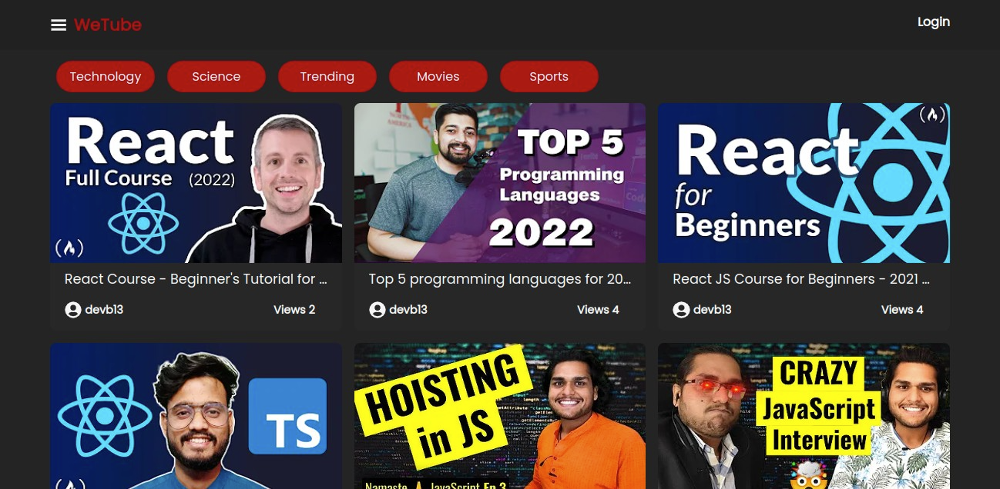
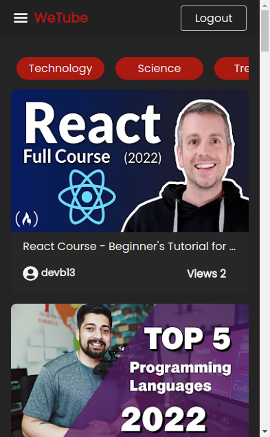
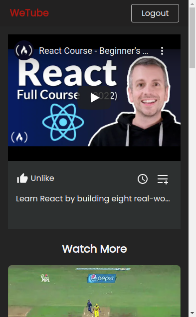
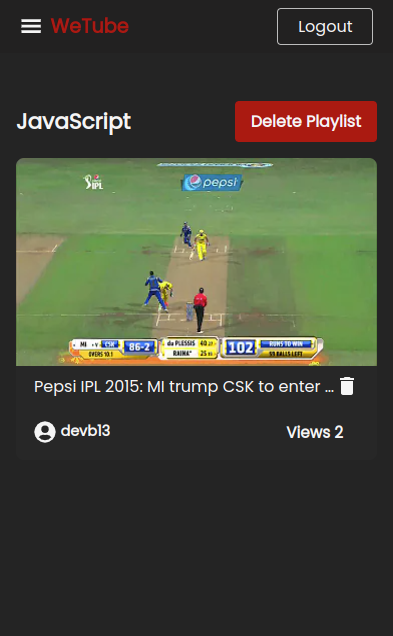

[](https://github.com/Debarshi95/Wetube/actions)

# FlixNotes

A ReactJS web app for managing notes.

## Demo

[Deployed on Netlify using github actions](https://debarshib-wetube.netlify.app)

## Features:

- Authentication facility for old & new users
- Authenticated users can
  - can see a landing page with a list of few categories
  - sort videos based on categories
- Individual video listing page with suggested videos
- Playlist, Watch History, Watch Later functionality for authenticated users
- PlayList Management:
  - User can create playlist.
  - User can add/delete video from playlist
  - User can delete a playlist.
- History:
  - Each register user when sees individual video has a view history
  - Videos in view history can be deleted by user
  - User can also clear full history
- Watch Later:
  - Each user can add/delete video to watch later
  - Video added to watch later can seen in watch later route by user
- Each registered user can like/dislike video anytime they want.
- Custom view count for videos watched.
- LazyLoading/Code-splitting of components to dynamically load at runtime
- Error management using ErrorBoundary to catch and show fallback UI.
- Loading Spinner when fetching initial data.
- Responsive UI for all screens (Desktop, Tablet, Mobile)

## Built using:

- [ReactJS](https://reactjs.org/) - Frontend framework
- [React Router](https://reactrouter.com/) - For routing & navigation
- [React-Hot-Toast](https://react-hot-toast.com) - to show Toast Notifications
- [ApolloGraphql](https://www.apollographql.com) - To make network to backend graphql server

## Screenshots

#### Desktop




<br/>

#### Mobile

<br/>
<div align="center">








</div>

## Run Locally

- Clone the project
  `git clone https://github.com/Debarshi95/WeTube.git`
- Go to the project directory
- cd wetube
- Install dependencies
  `yarn`
- Create a **.env** file
- Create a project inside Google Firebase and export the configuration
- Add the following configuration to your .env file

```
REACT_APP_APOLLO_URI="Backend server url"
```

- Start the server
  `yarn start`
